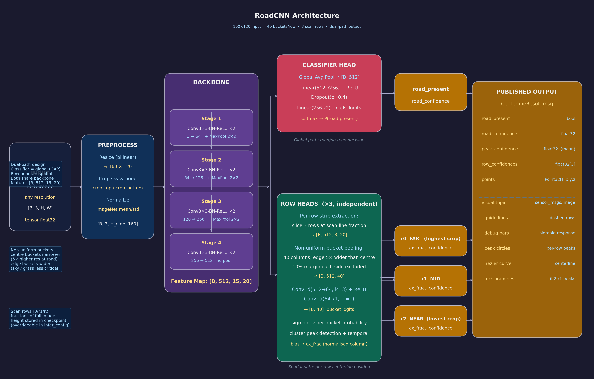
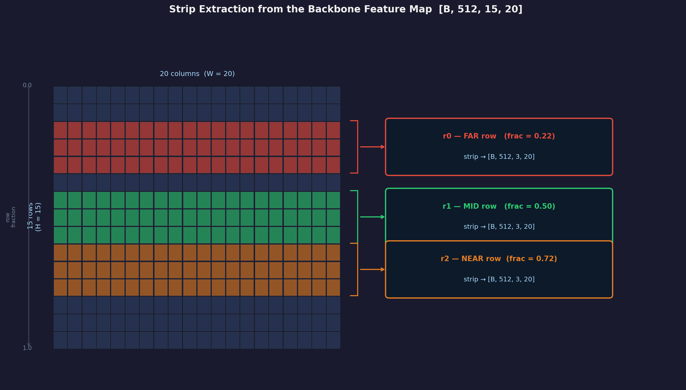
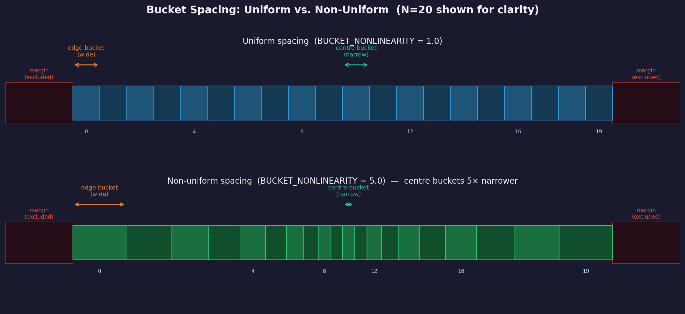
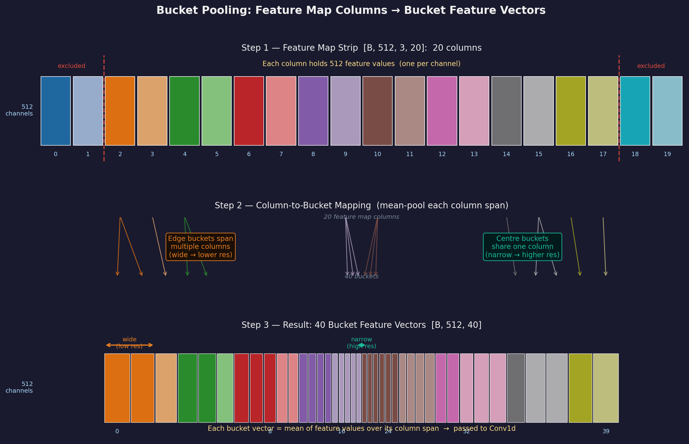
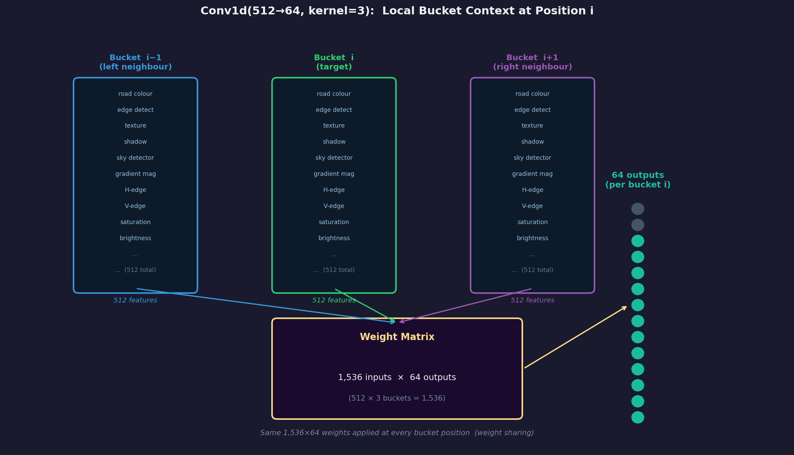
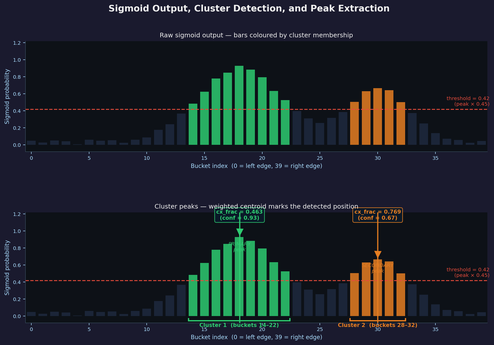

# RoadCNN Architecture — Detailed Design Notes

## Overview

RoadCNN is a convolutional neural network that estimates the road centerline position
from a single RGB camera image. Given any input image it produces:

- A **road-present classification** (is there a road in this image?)
- Three **per-row centerline positions** — one for each of three horizontal scan lines
  at configurable depths in the image (far, mid, near)

The architecture is a **dual-path shared backbone**: one backbone network does the
feature extraction, and then two separate paths branch off — a global classifier head
and a set of spatially-aware row heads.

---

## Input and Preprocessing

```
Input:  RGB image  [B, 3, H, W]  — any resolution
```

`B` is the batch size (how many images are processed simultaneously — typically 16
during training and 1 during inference). The `3` represents the three colour channels
(Red, Green, Blue). `H` and `W` are the height and width in pixels.

The model accepts **any input resolution** because the first thing it does internally
is resize to the fixed training resolution of **160 × 120 pixels** using bilinear
interpolation. This means the same trained model works whether the camera produces
640×480, 320×240, or 160×120 images.

After resizing, two further preprocessing steps are applied:

**Cropping** — A configurable fraction of the top and bottom of the image is removed.
The top crop eliminates sky, which contains no useful road information and would
otherwise waste model capacity. The bottom crop eliminates the vehicle hood if visible.
The crop fractions are stored in the checkpoint and read from `dataset.info` at
training time.

**Normalisation** — Each pixel value is first scaled from the raw 0–255 integer range
to a 0.0–1.0 floating point range by dividing by 255. Then per-channel normalisation
is applied using the ImageNet statistics:

```
mean = [0.485, 0.456, 0.406]   (Red, Green, Blue)
std  = [0.229, 0.224, 0.225]   (Red, Green, Blue)
```

The formula applied to each pixel in each channel is:

```
normalised = (pixel_value / 255 − mean) / std
```

For example, a pure red pixel (R=255, G=0, B=0) becomes:

```
R: (1.000 − 0.485) / 0.229 =  +2.25
G: (0.000 − 0.456) / 0.224 =  −2.04
B: (0.000 − 0.406) / 0.225 =  −1.80
```

The result is that most natural image pixels land roughly in the range −2.5 to +2.5,
centred near zero with a standard deviation near 1.0.

**Why these specific values?** These are the mean and standard deviation of the
ImageNet dataset — the large image collection on which most CNN backbones are
pre-trained. By normalising with the same statistics the backbone saw during
pre-training, the activations start in a healthy range from the very first layer.
Without this normalisation the first few layers would receive inputs far outside
their expected range, slowing convergence and potentially causing unstable gradients
early in training.

Even though this model was trained from scratch (not fine-tuned from an ImageNet
pre-trained backbone), using ImageNet statistics is still a good default: ImageNet
images are broadly representative of natural outdoor scenes, and the statistics
ensure a well-scaled input regardless of the specific dataset used.

After preprocessing, the tensor is `[B, 3, H_crop, 160]`.

---

## The Tensor Shape Notation

Throughout this document tensor shapes are written as `[B, C, H, W]` where:

| Symbol | Meaning |
|--------|---------|
| `B` | Batch size — number of images processed at once |
| `C` | Channels — number of feature maps at this layer |
| `H` | Height — number of rows in the spatial grid |
| `W` | Width — number of columns in the spatial grid |

As the image passes through convolutional layers the spatial dimensions (H, W) shrink
while the channel count (C) grows. Each channel is a learned feature detector — a map
of where a particular visual pattern (edge, colour, texture) appears in the image.

---

## Backbone


*Figure 1 — Full RoadCNN architecture showing the backbone, dual-path split, classifier head, row heads, and published outputs.*

The backbone is a stack of four stages. Each stage applies the sequence
Conv3×3-BN-ReLU **twice in a row** before the MaxPool — this is what the ×2 notation
in the architecture diagram indicates. Expanded out, a single stage looks like this:

```
Conv3×3 → BN → ReLU       ← first pass
Conv3×3 → BN → ReLU       ← second pass
MaxPool 2×2                ← spatial downsampling (Stages 1–3 only)
```

The reason for applying it twice rather than once is depth. The first convolution
detects simple local patterns — edges, colour gradients, small textures. The second
convolution then operates on those outputs and can combine them into more complex
patterns — corners, curves, junctions, road-surface textures. Two sequential conv
layers with non-linear activations between them have strictly more expressive power
than a single conv layer, even if the total number of parameters were the same.

The first three stages are followed by a MaxPool that halves the spatial dimensions.
The fourth stage has no pool.

```
Input:           [B,   3, 120, 160]

Stage 1:  Conv3×3-BN-ReLU → Conv3×3-BN-ReLU  (  3 →  64 channels)
          MaxPool 2×2
          Output:          [B,  64,  60,  80]

Stage 2:  Conv3×3-BN-ReLU → Conv3×3-BN-ReLU  ( 64 → 128 channels)
          MaxPool 2×2
          Output:          [B, 128,  30,  40]

Stage 3:  Conv3×3-BN-ReLU → Conv3×3-BN-ReLU  (128 → 256 channels)
          MaxPool 2×2
          Output:          [B, 256,  15,  20]

Stage 4:  Conv3×3-BN-ReLU → Conv3×3-BN-ReLU  (256 → 512 channels)
          No pool
          Output:          [B, 512,  15,  20]   ← feature map
```

### Conv3×3

Each convolutional layer slides a 3×3 filter across the spatial grid. At each
position the filter computes a weighted sum of the 3×3 neighbourhood of input values.
With `padding=1` the output spatial size matches the input. What the filter detects
is learned from training data — early layers tend to learn edges and colour gradients,
later layers learn more complex textures and shapes.

### Batch Normalisation (BN)

Batch Normalisation normalises the output of each convolutional layer so that
activations have approximately zero mean and unit variance, computed across the current
training mini-batch:

```
output = (input − mean) / std       ← normalise to ~N(0,1)
output = output × γ + β             ← learnable rescale and shift
```

`γ` and `β` are learned parameters — the network can "undo" the normalisation if
needed. At inference time the running mean and std accumulated during training are
used instead of batch statistics.

BN stabilises training significantly. Road images vary widely in brightness and
contrast (sunny, overcast, shadows, tunnels). Without BN a bright frame could produce
very different activation magnitudes than a dark frame, causing subsequent layers to
behave inconsistently. BN keeps each layer's input distribution stable regardless of
lighting conditions.

### ReLU

The Rectified Linear Unit applies the function `output = max(0, input)`. It
introduces non-linearity — without it the entire network would collapse to a single
linear transformation regardless of depth. ReLU is used `inplace=True` to avoid
allocating extra memory.

### MaxPool 2×2

MaxPool takes the maximum value in each 2×2 window and discards the rest, halving the
spatial dimensions. Three MaxPool layers reduce the 120×160 input to a 15×20 feature
map. A fourth pool was deliberately omitted: it would produce a 7×10 feature map with
only 7 rows, which is too few to extract well-separated strip features for three scan
lines. Stopping at 15 rows preserves adequate spatial resolution for the row heads.

### Feature map spatial resolution

After three MaxPool layers the 15×20 feature map retains enough rows to place three
well-separated strips. The diagram below shows this: each coloured band in the grid
represents the 3-row strip extracted for one scan line.


*Figure 2 — The 15×20 backbone feature map with the three horizontal strips highlighted.
Each strip is extracted at its scan-line's row fraction and produces a [B, 512, 3, 20]
tensor passed to its row head.*

### Channel doubling

Each stage doubles the channel count (3→64→128→256→512). This is a standard
convention from the VGG family of networks. As spatial resolution decreases the
network compensates by increasing the number of feature detectors, maintaining
representational capacity throughout the hierarchy.

### Feature map

After Stage 4 the feature map is `[B, 512, 15, 20]`. It contains 512 channels of
learned features at 300 spatial locations (15×20 grid). Position (row r, col c) in
the feature map corresponds to the same relative region of the original image — the
spatial structure is preserved throughout the backbone. Each of the 512 values at a
given location represents the strength of a different learned visual feature at that
image region.

---

## Dual-Path Design

At the feature map the network splits into two independent paths:

```
                    [B, 512, 15, 20]
                          │
              ┌───────────┴───────────┐
              │                       │
      Classifier Head           Row Heads (×3)
      (global question)         (spatial question)
              │                       │
    road_present?             where is the road
    road_confidence           at each scan line?
```

The split is intentional: the two tasks require fundamentally different operations.
Road presence is a scene-level property best answered by collapsing spatial information
entirely. Centerline position is a spatial property that requires spatial structure to
be preserved all the way to the output.

---

## Classifier Head

```
[B, 512, 15, 20]
  → Global Average Pool     →  [B, 512, 1, 1]
  → Flatten                 →  [B, 512]
  → Linear(512 → 256)       →  [B, 256]    ← fully connected
  → ReLU
  → Dropout(p=0.4)
  → Linear(256 → 2)         →  [B, 2]      ← fully connected
  → softmax                 →  road_confidence
```

### Global Average Pooling (GAP)

GAP averages each channel across the entire 15×20 spatial grid, collapsing it to a
single number. The output is one scalar per channel — 512 scalars total — each
representing the mean strength of that feature detector across the whole image.

This is the right operation for a global question. If channel 47 detects
"road-coloured texture", its GAP output is the average presence of that texture
everywhere in the image. The classifier does not need to know *where* road features
are, only whether they are present.

The alternative — flattening the 15×20 grid directly — would produce 153,600 inputs
to the first linear layer instead of 512, with a correspondingly enormous weight
matrix. GAP compresses spatial information gracefully before the fully connected
layers, with far fewer parameters.

### Fully Connected Layers

The two `Linear` layers are fully connected: every input value connects to every
output value through a learned weight. `Linear(512→256)` has 512×256 = 131,072
weights. `Linear(256→2)` has 512 weights. The output is two logits, one for
"no road" and one for "road present". Softmax converts these to probabilities.

### Dropout

Dropout randomly zeroes 40% of the activations during training. This prevents any
single neuron from becoming too important and forces the network to learn redundant
representations — a form of regularisation that reduces overfitting. Dropout is
disabled at inference time.

---

## Row Heads

There are three independent row heads, one per scan line (r0 = far, r1 = mid,
r2 = near). Each follows the same structure but has its own learned weights and
operates at a different vertical position in the feature map.

### Step 1 — Strip extraction

The scan line's fractional position in the full image (e.g. 0.60 for 60% of the way
down) is remapped into the cropped image's coordinate space and then into the feature
map's row index. A thin horizontal strip of 3 rows is extracted at that position:

```
[B, 512, 15, 20]  →  strip at row fraction  →  [B, 512, 3, 20]
```

Using 3 rows rather than 1 provides robustness against the scan line falling between
feature map rows due to the 8× spatial downsampling.

### Step 2 — Non-uniform bucket pooling

The diagram below compares uniform and non-uniform spacing for N=20 buckets. In the
actual model N=40 with the same principle applied.


*Figure 3 — Top: uniform bucket spacing (every bucket the same width). Bottom:
non-uniform spacing with BUCKET_NONLINEARITY=5.0 — centre buckets are 5× narrower
than edge buckets, concentrating prediction resolution where the road is most likely
to appear. The red-shaded margin regions on each side are excluded entirely.*

The 20 feature map columns are pooled into **40 buckets** using pre-computed edge
tables. This is not uniform: with `BUCKET_NONLINEARITY=5.0`, centre buckets are
approximately 5× narrower than edge buckets. The effect is higher spatial resolution
near the image centre where the road is most commonly found, and lower resolution
near the edges where sky, vegetation, or off-road terrain dominate.

Each row also has a **lateral margin** of 10% on each side, meaning buckets span only
from 10% to 90% of the image width. The outermost edge pixels are excluded entirely.

```
[B, 512, 3, 20]  →  bucket pooling (40 buckets, non-uniform)  →  [B, 512, 40]
```

The vertical dimension (3 rows) is averaged away at the same time, leaving a 1D
sequence of 512-dimensional feature vectors, one per bucket.

The diagram below shows the full pooling process across all three steps:


*Figure 4 — The bucket pooling process. Top: the 20 feature map columns, each holding
512 feature values. Middle: the column-to-bucket mapping — edge buckets span multiple
columns (wide, lower resolution) while centre buckets share a single column (narrow,
higher resolution). The arrows show which source columns feed each destination bucket.
Bottom: the resulting 40 bucket feature vectors passed to the Conv1d head. Colour
coding is consistent across all three panels so you can trace each source column
through to its output bucket.*

### Step 3 — Conv1d: 512 → 64

```
Conv1d(512 → 64, kernel=3, padding=1) + ReLU
[B, 512, 40]  →  [B, 64, 40]
```

At each bucket position this layer takes the 512 features from that bucket plus the
512 features from each of its two neighbours — 1,536 total inputs — and produces 64
output values via a 1,536×64 weight matrix. The same weight matrix is shared across
all 40 bucket positions (this is the "convolution" aspect).

The 64 output channels are learned combinations of the 512 backbone features, tuned
by training to represent road-relevant signals. The ReLU introduces non-linearity
after this compression step, allowing the subsequent layer to operate on a more
expressive intermediate representation than a single linear step would permit.

The kernel size of 3 is important: it means each output bucket's score is informed by
its immediate neighbours, reflecting the fact that the road is spatially continuous
across bucket boundaries.

The choice of 64 channels is a design decision. Going directly from 512 to 1 in a
single step is technically possible and would likely perform similarly given how
constrained the task is, but the intermediate representation with a non-linearity
gives the network slightly more capacity to combine features before making the final
prediction.


*Figure 5 — At each bucket position i, the Conv1d(512→64, kernel=3) takes 512 features
from bucket i-1, 512 from bucket i, and 512 from bucket i+1 — 1,536 inputs total —
and produces 64 output values via a shared 1,536×64 weight matrix. The same weights
are applied at every bucket position.*

### Step 4 — Conv1d: 64 → 1

```
Conv1d(64 → 1, kernel=1)
[B, 64, 40]  →  [B, 1, 40]  →  squeeze  →  [B, 40]   bucket logits
```

A pointwise convolution (kernel=1) collapses the 64 channels into a single confidence
logit per bucket. This is a learned weighted vote across all 64 features at each
position independently. No neighbour information is used at this step.

### Step 5 — Post-processing (inference only, not in the model)

The diagram below shows a synthetic example of the 40 sigmoid outputs for one row,
with two clusters detected and their weighted centroids marked.


*Figure 6 — Top: raw sigmoid probabilities for all 40 buckets, coloured by cluster
membership. The dashed red line is the threshold (peak confidence × 0.45). Bottom:
the two detected clusters with their weighted centroids (cx_frac) marked by downward
arrows. The primary peak (green, higher confidence) is used as the centerline estimate;
the secondary peak (orange) triggers fork detection if it is sufficiently strong.*

```
sigmoid  →  per-bucket probability  [0.0 – 1.0]
```

The 40 logits are passed through sigmoid to produce probabilities. Post-processing
then applies:

- **Cluster detection** — contiguous runs of buckets above a threshold are identified
  as clusters. There is one peak per cluster (weighted centroid).
- **Temporal bias** — when multiple clusters exist, the cluster closest to the
  previous frame's peak is preferred, providing temporal consistency.
- **Fork detection** — if two well-separated clusters exist on a row, both are kept
  as separate branch peaks (split road).
- **Road momentum** — if the current frame produces no valid road detection, the
  previous frame's peaks are held for a few frames before dropout.

---

## Output

```
cls_logits   [B, 2]          →  road_present (bool), road_confidence (float)
r0_logits    [B, 40]         →  far scan line:  cx_frac, confidence
r1_logits    [B, 40]         →  mid scan line:  cx_frac, confidence
r2_logits    [B, 40]         →  near scan line: cx_frac, confidence
```

The three `cx_frac` values (normalised horizontal positions, 0=left, 1=right) are
assembled into a cubic Bezier curve that forms the road centerline estimate. In the
ROS2 node these are published as a `CenterlineResult` message containing
`road_present`, `road_confidence`, `peak_confidence`, per-row confidences, and a
`Point32[]` array of centerline sample points.

---

## Parameter Count

| Component | Parameters (approx.) |
|-----------|----------------------|
| Stage 1 (3→64) | 38,000 |
| Stage 2 (64→128) | 295,000 |
| Stage 3 (128→256) | 1,180,000 |
| Stage 4 (256→512) | 4,720,000 |
| Classifier head | 133,000 |
| Row heads (×3) | 300,000 |
| **Total** | **~6.7 M** |

---

## Design Lineage

The architecture draws on established CNN conventions:

- **Conv-BN-ReLU double blocks** — VGG (Simonyan & Zisserman, 2014)
- **Progressive channel doubling** — VGG-style, widely adopted
- **Global Average Pooling for classification** — Network in Network (Lin et al., 2013)
- **Dual-path shared backbone** — standard multi-task learning pattern
- **Row strip extraction + 1D head** — custom design for this task; preserves
  horizontal spatial structure at known vertical positions while compressing backbone
  features into per-bucket scores
